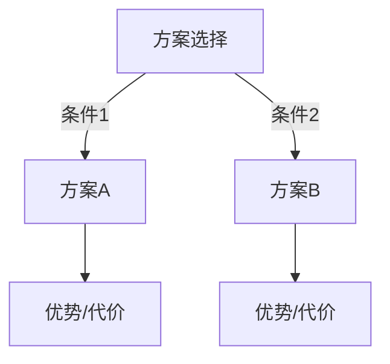

# grill-with-docs — Let Your Docs Take the Heat

## 概念

grill-me 是 AI 拷问用户。而 **grill-with-docs** 是用户把文档/方案交给 AI，AI 作为一个「被拷问的子代理」(subagent)，**基于文档替你回答所有拷问**。

如果有一份已经写好的方案/PRD/架构文档，你不想再把问题过一遍——让 AI 基于文档自己回答。

## 工作流

### Step 1: 加载文档

用户提供文档来源（文件路径、URL、或粘贴内容），你以之为依据。

### Step 2: 派出 subagent 自审

对每一组拷问问题，subagent 基于文档给出回答。回答格式：

```
## 拷问问题：{问题}

### FACTS（事实）
{文档中明确写了的、可验证的内容}

### TRADE-OFFS（权衡）
{如果文档隐含了权衡选择，列出 A vs B 的取舍}

### WHY（原因）
{为什么文档选择这个方案而不是另一个}

### GAPS（盲区）
{文档没有覆盖到的、但应该有的内容}

### RISK（风险）
{这个方案下可能出问题的点}
```

### Step 3: 输出审查报告

最终输出一份完整的方案审查报告：

```
## grill-with-docs 审查报告

### 方案摘要
{facets 层的高层概述}

### 结构完整度评分
- 定位与目标：{评分}/10 + 评语
- 范围与边界：{评分}/10 + 评语
- 技术方案：{评分}/10 + 评语
- 风险识别：{评分}/10 + 评语
- 数据方案：{评分}/10 + 评语
- 部署与运维：{评分}/10 + 评语

### 发现的盲区
{文档中未提及的重要事项，按严重程度排序}

### 建议改进
{基于盲区给出的具体改进建议，可直接写入文档}

### 关键决策树


### 下一轮迭代建议
{建议用户补充哪些内容后再跑一轮}
```

## 子代理执行规范

当启动 subagent 执行时：

1. **指定依据** — 明确告诉 subagent：「你只基于以下文档内容回答，不要编造」
2. **分轮执行** — 每一组问题（Phase 1/2/3/4）作为一轮，每轮输出 FACTS/TRADE-OFFS/WHY/GAPS/RISK
3. **边界标记** — 如果问题在文档中找不到答案，标记为「文档未覆盖」，而不是猜测
4. **输出持久化** — 将审查报告写入文件（如 `grill-report-{timestamp}.md`），供后续参考

## 拷问问题集

### 定位与目标
- 这个方案解决什么问题？
- 目标用户是谁？
- 成功标准是什么？
- 与现有方案的区别是什么？

### 架构与技术
- 为什么选这个技术栈？
- 数据流是怎样的？
- 扩展性怎么保障？
- 有没有做技术选型的对比分析？

### 风险与边界
- 依赖了哪些外部系统/API？
- 失败模式有哪些？
- 安全考虑有哪些？
- 监控和告警怎么做？

### 运维与交付
- 部署策略是什么？
- 回滚方案是什么？
- 测试覆盖了多少？
- 文档（运维文档/用户文档）在哪里？

## 使用场景

| 场景 | 用法 |
|------|------|
| 有一份 PRD/需求文档 | `grill-with-docs PRD.md` |
| 有一份架构设计文档 | `grill-with-docs architecture.md` |
| 有一份 API 设计稿 | `grill-with-docs api-spec.md` |
| 有一份会议纪要/BRD | `grill-with-docs brd.md` |
