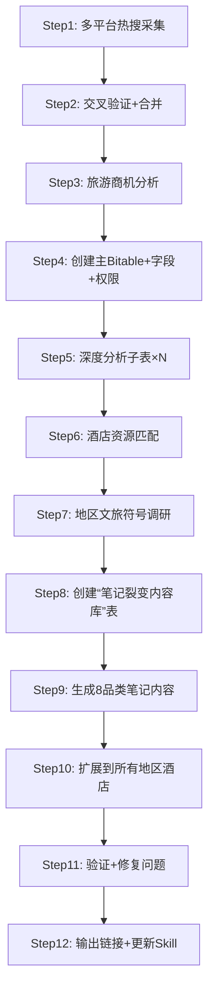

# 热点商机多维分析 Skill

> 一条龙：抓热搜 → 交叉验 → 商机析 → 主表库 → 深挖子表 → 文旅调研 → 笔记裂变

## 触发词

- "整理热点" / "今日热点" / "热点分析"
- "做一遍热点调研"
- "生成笔记裂变"

## ⚠️ 核心原则

### 原则1：永远使用选项名称，不是 optID

```python
# ✅ 正确
"来源渠道": ["微博热搜", "百度热搜"]   # MultiSelect 传数组
"优先级": "高"                          # SingleSelect 传字符串

# ❌ 错误
"来源渠道": ["opt6mByzqo", "optTzXkli7"]
"优先级": "optcTwW4fI"
```

### 原则2：备注链接必须URL编码

```python
import urllib.parse
# ✅ 正确
url = 'https://s.weibo.com/weibo?q=' + urllib.parse.quote('#话题名#')
```

### 原则3：全部用Python，不要用Bash

❌ Bash 不兼容：`declare -A` 在 zsh 报错、heredoc 变量空值、JSON 解析脆弱
✅ 统一 Python，token 在脚本内部获取

### 原则4：每次操作后验证

code=0 不代表真写入！GET 再读一次确认。

### 原则5：重试必去重

脚本失败后重跑前，先 delete_all_records() 清空目标表。

### 原则6：每次拿新token

脚本第一行就重新获取，不复用。

---

## 工作流概览（完整链路12步）



---

## Step 1-6: 热点分析流程（详见下方各节）

| 步骤 | 核心内容 | 产出 |
|------|---------|------|
| **Step 1** | 8平台并行采集 | 微博/百度/头条/知乎/抖音/36氪/B站/贴吧 |
| **Step 2** | 跨平台合并重复话题 | 去重后的热点集合 |
| **Step 3** | 逐条分析地点/景点/商机/优先级 | 带 ⭐ 标记的商机清单 |
| **Step 4** | 创建Bitable+字段+批量插入+公开权限 | 主数据表（15条） |
| **Step 5** | 创建热点地区子表（酒店/景点/美食/活动） | 5个深度分析子表 |
| **Step 6** | 飞书资源表读取+酒店匹配 | 已入库/待拓展标注 |

> 详细API参考下方「Step 4: 创建 Bitable」及后续章节

---

## 笔记裂变内容库（新增核心模块）

这是2026-05-27实践落地的新模块。在完成热点分析后，对涉及的热点地区酒店，生成**8品类×每家酒店**的小红书风格笔记，形成内容矩阵。

### 创建流程

```
Step 1: 创建子表"笔记裂变内容库"
Step 2: 设计字段 → 笔记标题(主) | 酒店名称(Select) | 内容品类(Select 8项)
          | 正文文案(Text/长) | 引用话题(Text) | 对标爆款风格(Text) | 备注(Text)
Step 3: 更新酒店选项 → 加入所有要覆盖的酒店名称
Step 4: 更新品类选项 → 8品类全量
Step 5: 批量生成 + batch_create 写入

⚠️ 注意：表名用 PATCH 修改，不是 PUT
```

### 字段结构

| 字段名 | 类型 | 说明 |
|--------|------|------|
| 笔记标题 | Text(主) | 带情绪钩子的标题 |
| 酒店名称 | Select | 6家(可扩展)：腾冲石头纪/丽江悦榕庄/塞尔维亚凯悦/上海丽思/张家界禾田居/成都W酒店 |
| 内容品类 | Select | 8品类单选项 |
| 正文文案 | Text(长) | ❌无具体金额，只说「打折优惠」 |
| 引用话题 | Text | 15-20个#话题标签 |
| 对标爆款风格 | Text | 参考的小红书爆款风格说明 |
| 备注 | Text | 核心卖点提炼 |

### 8大内容品类总表

| # | 品类 | 定位 | 标题风格 | 文案调性 | 对标对象 |
|---|------|------|---------|---------|---------|
| 1 | 💎 高净值度假客/蜜月 | 品质感·品牌溢价 | ✨/🌅 emoji·情绪 | 📸🍽️🛁分段·细节描写 | 酒店控类高赞笔记 |
| 2 | 💼 商务实效型 | B端转化 | 标题含｜·结论前置 | 📋💼🎯📊数据化·客观 | 职场人实测类 |
| 3 | ⚡ 实时红利截流型 | 急迫转化·引流 | ⚠️🔥⏰ 紧迫感 | ✅清单+⚠️+💬评论区钩子 | 限时优惠截流爆款 |
| 4 | 🌿 种草型范流量号 | 泛流量拉新 | 散文式·情绪第一 | 短句留白·零广告感·情绪>信息 | 生活美学/治愈系大流量号 |
| 5 | 📖 干货价值类 | 高信息密度·收藏 | 「全攻略」「一篇讲透」 | 🏠🍽️🎯🚗分段+评分 | 酒店测评高收藏笔记 |
| 6 | 🛠️ 教程攻略类 | 实用教程·转发 | 「手把手」「秘籍公开」 | 📱💡🎁📝Step-by-step | 教程类爆款 |
| 7 | ⚠️ 避坑类 | 中立可信·高信任 | 「拔草帖」「真心话」 | ✅❌对比·先说缺点再说优点 | 真实测评类 |
| 8 | 🏢 行业垂直类 | 专业壁垒·深度 | 「产品拆解」「N年」 | 🏗️📐🎯行业视角 | 行业分析类 |

### 笔记生成原则

1. ❌ **正文不写具体金额**（不用具体价格数字，只说「打折优惠」「限时优惠」「有活动」）
2. ✅ 每品类针对一家酒店写一篇，形成 品类×酒店 内容矩阵
3. ✅ 结合「地区文旅符号调研」的8维度数据：金招牌+市井风情+季节限定+避坑槽点+商业闭环
4. ✅ **自动合规校验**：每条正文生成后自动过 xiaohongshu_compliance.py 模块扫描
5. ✅ 违禁词自动替换为合规替代表达，替换项输出日志
6. ✅ 标题/正文/话题标签三关全检
4. ✅ 引用话题15-20个，覆盖精准标签+泛流量标签
5. ✅ 正文用 emoji 小标题分段（表情符号增强可读性）
6. ✅ 每个地点选1-2家主推酒店（优先资源表中「已入库」的）
7. ✅ 种草型用散文体，不写商品感；截流型加评论区互动钩子

### 2026-05-27 已覆盖酒店

| 地区 | 主推酒店 | 品类覆盖 | 数据来源 |
|------|---------|---------|---------|
| 腾冲 | 腾冲石头纪 | 8/8 | 酒店资源表⭐已入库 |
| 丽江 | 丽江悦榕庄 | 8/8 | 酒店资源表⭐已入库 |
| 塞尔维亚·贝尔格莱德 | 贝尔格莱德凯悦 | 8/8 | 文旅调研+酒店资源表 |
| 上海 | 浦东丽思卡尔顿 | 8/8 | 酒店资源表⭐已入库 |
| 张家界 | 禾田居度假酒店 | 8/8 | 文旅调研+本地推荐 |
| 成都·乐山 | 成都W酒店 | 8/8 | 酒店资源表⭐已入库 |

### 新增酒店扩展步骤

当需要为新的地区/酒店生成笔记时：

1. 给「酒店名称」字段追加选项（PATCH field property.options）
2. 从文旅调研表中读取该地区全维度数据
3. 按8品类模板各写一篇（参考已有风格）
4. batch_create 批量插入
5. 验证每篇的「酒店名称」字段非空

---

## 完整流程速查

```
┌─────────────────────────────────────────────────────────┐
│  第一阶段：热点分析                                    │
│  1. 多平台热搜采集 (opencli / web_fetch)                │
│  2. 交叉验证→去重→合并                                 │
│  3. 旅游商机分析→优先级评定                            │
│  4. 创建主Bitable→字段配置→批量插入→权限公开           │
│  5. 创建深度分析子表 (高/中优先级热点地区)              │
│  6. 地区文旅符号调研 (8维度×N地区)                     │
├─────────────────────────────────────────────────────────┤
│  第二阶段：笔记裂变                                    │
│  7. 创建"笔记裂变内容库"子表                            │
│  8. 配置字段：酒店名称(Select)+内容品类(Select 8项)    │
│  9. 结合文旅调研数据生成8品类笔记内容                   │
│ 10. batch_create写入→验证酒店名称非空                   │
│ 11. 扩展到所有覆盖地区（每家酒店8篇）                   │
│ 12. 自动合规校验 → 违禁词替换                          │
│ 13. 输出链接给永乐                                     │
└─────────────────────────────────────────────────────────┘
```

---

## Step 4: 创建 Bitable（详细API）

### 4.1 获取 Token

```python
import urllib.request, json, os, re

# 解析 config.toml（注意：configparser 不能解析 TOML 格式，需手动 parse）
with open(os.path.expanduser('~/.openclaw/config.toml')) as f:
    lines = f.readlines()

def get_val(key):
    for line in lines:
        s = line.strip()
        if s.startswith(key):
            eq = s.index('=')
            return s[eq+1:].strip().strip('"').strip("'")
    return None

APP_ID = get_val('appId')
APP_SECRET = get_val('appSecret')

body = json.dumps({"app_id": APP_ID, "app_secret": APP_SECRET}).encode()
req = urllib.request.Request(
    'https://open.feishu.cn/open-apis/auth/v3/tenant_access_token/internal',
    data=body, headers={'Content-Type': 'application/json'})
with urllib.request.urlopen(req) as f:
    TOKEN = json.loads(f.read().decode())['tenant_access_token']
```

### 4.2 创建 Bitable

```bash
curl -s -X POST 'https://open.feishu.cn/open-apis/bitable/v1/apps' \
  -H "Authorization: Bearer $TOKEN" \
  -H 'Content-Type: application/json' \
  -d '{"name":"热点商机多维分析 YYYY-MM-DD"}'
```

返回：`app_token` + `default_table_id`

### 4.3 字段结构

| 字段 | type | 说明 |
|------|------|------|
| 热点话题 | 1(Text) | 主字段，重命名默认字段 |
| 来源渠道 | 4(MultiSelect) | 微博/百度/知乎/抖音/小红书/B站/综合/头条/贴吧/36氪 |
| 话题类别 | 3(SingleSelect) | 航天科技/社会民生/天气灾害/财经股市/国际外交/科技AI/体育赛事/文旅美食/健康生活/教育 |
| 热度指数 | 1(Text) | 原始热度描述 |
| 热度指数数值 | 2(Number) | 整数热度 |
| 关联地点 | 1(Text) | 城市/区域 |
| 关联旅游景点 | 1(Text) | 可借势的景点 |
| 旅游商机分析 | 1(Text) | 长文本+⭐标记 |
| 优先级 | 3(SingleSelect) | 高/中/低 |
| 备注 | 1(Text) | 📎来源链接 |

### 4.4 → 4.5 删除空记录 → 插入 → 验证 → 权限

详见原文档 Step 4.4-6 部分。关键：
- 默认10条空记录，逐个 DELETE
- batch_create 每批≤10条
- 验证用 GET 读取（不只看 code）
- 权限：PATCH public + POST member

---

## 深度分析子表 / 文旅调研

见原文档 Step 7-10。核心要点：
- 子表名格式：`城市·热点关键词概括`
- 子表字段：名称/类别(Select 6项)/推荐理由/参考价格/关联热度/详情链接/备注
- 文旅调研8维度：基础信息/金字招牌/市井风情/视觉资产/季节限定/避坑槽点/商业闭环

---

## 数据源配置

**已验证稳定：**
| 平台 | 命令 | 输出字段 |
|------|------|---------|
| 微博热搜 | `opencli weibo hot --limit 20 -f json` | word/category/hot_value/rank/url |
| 今日头条 | `opencli toutiao hot -f json --limit 15` | title/hot_value/rank/url |
| 抖音热点 | `opencli douyin hashtag hot --limit 20 -f json` | name/view_count/id |
| 知乎热榜 | `opencli zhihu hot --limit 15 -f json` | title/heat/answers/rank/url |
| 贴吧热榜 | `opencli tieba hot --limit 15 -f json` | title/discussions/url |
| 36氪热榜 | `opencli 36kr hot -f json --limit 15` | title/rank/url |
| B站热门 | `opencli bilibili hot --limit 15 -f json` | title/play/danmaku/bvid/url |
| 百度热搜 | `web_fetch https://top.baidu.com/board?tab=realtime` | readability 提取 |

---

## 🐛 踩坑记录（每次必读）

### 2026-05-27

1. **备注链接不能跳转** → `urllib.parse.quote('#话题#')` 编码中文
2. **子表内容重复两倍** → 重跑前 delete_all_records()
3. **batch_create 假成功** → code=0 但数据没写，需 GET 验证
4. **appSecret 被截断** → 用 Python parse config，不要 grep
5. **zsh 不兼容 declare -A** → 全部用 Python
6. **石头记→石头纪（错字）** → 酒店名核对官方名称
7. **正文含金额被退** → 只说「打折优惠」不写具体数字
8. **Text→Select 字段数据丢失** → 更新选项后需要写脚本重新填充所有记录的酒店名称
9. **PATCH 修改表名** → PUT 返回 404，要用 PATCH

---

## 文件结构

```
hotspot-bitable-analysis/
  SKILL.md                               # 主文档（完整工作流）
  references/
    xiaohongshu-forbidden-words.md       # 小红书违禁词/合规替换速查表
  scripts/
    insert_records.py                    # 主表记录插入模板
    xiaohongshu_compliance.py            # 小红书内容合规自动校验模块
```

### 合规校验模块用法

```python
# 在笔记生成脚本中引入
import sys
sys.path.append('skills/hotspot-bitable-analysis/scripts')
from xiaohongshu_compliance import audit_and_fix

# 每条正文产出后自动校验
for record in records:
    body = record["正文文案"]
    clean_body, violations = audit_and_fix(body)
    if violations:
        print(f'[合规] {record["笔记标题"][:20]} - {len(violations)}处替换')
    record["正文文案"] = clean_body
```

违禁词涵盖7大类：绝对化用语/夸大效果/医疗健康/营销引流/标题标签/私信评论/平台红线。详细替换表见 `references/xiaohongshu-forbidden-words.md`。
