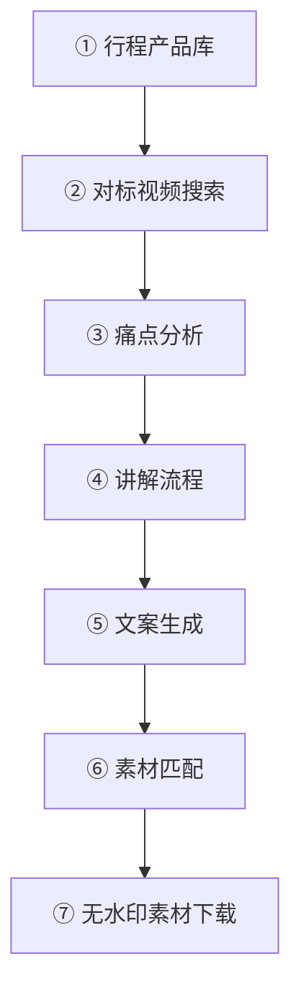

# 视频生成工坊

> 从行程表到一条口播+画面的短视频，全链路自动化。
> 一句话：**输入目的地 → 自动出脚本 + 搜对标 + 下素材**

---

## 核心流程（7步）



---

## 详细步骤

### Step 0: 前置准备

确保以下数据已就位：

1. **行程产品库**（Bitable）：产品名、天数、每日行程、住宿酒店等
2. **行程明细**（子表）：每天行程安排、活动亮点

### Step 1: 对标视频搜索

通过小红书搜索同类内容，获取脚本灵感和用户痛点。

```bash
# 小红书搜索
xhs search "<目的地> <关键词>" --json

# 读取笔记内容（含评论区）→ 分析用户真实痛点
xhs read <note-id> --json --xsec-token <token>
```

**输出** → `① 对标视频库`（Bitable子表）

字段：视频标题、来源平台、作者、点赞数、关联痛点、视频链接、关联产品

### Step 2: 痛点分析

从对标视频的正文 + 高赞评论中提炼用户核心痛点。

**输出** → `② 痛点分析`（Bitable子表）

字段：痛点描述、来源视频、目标人群、解决方案、关联产品、优先级

### Step 3: 讲解流程

将痛点 × 行程安排重组为脚本大纲（7步结构）。

标准结构：
| 步骤 | 环节 | 时长占比 |
|:----:|:-----|:--------:|
| 1 | 钩子开场 | 5s |
| 2 | 时间/季节选择 | 8s |
| 3 | 行程拆解 | 15s |
| 4 | 住宿推荐 | 8s |
| 5 | 行前准备 | 8s |
| 6 | 避坑指南 | 8s |
| 7 | 情感结尾 | 8s |

**输出** → `③ 讲解流程`（Bitable子表）

### Step 4: 文案生成

基于讲解流程，AI 自动生成完整口播文案（60-90秒）。

要求：
- 口语化、有网感
- 开头3行抓眼球
- 结尾引导互动（评论区扣1、收藏等）
- ❌ 正文不写具体金额（只说「打折优惠」「有活动」）
- ✅ 自动合规校验（替换违禁词）

**输出** → `④ 文案产出`（Bitable子表）

### Step 5: 素材匹配

将文案分段映射到对应镜头，标注每个镜头需要的素材类型。

**输出** → `⑤ 素材匹配`（Bitable子表）

字段：镜头编号、画面描述、对应文案、素材来源、素材链接/路径、是否已下载

### Step 6: 素材搜索与下载

从 YouTube 搜索高清无水印素材，默认 1080p。

```bash
# 搜索 YouTube
yt-dlp --no-check-certificate "ytsearch5:<关键词>" --dump-json

# 下载 1080p（默认画质）
yt-dlp --no-check-certificate -f "137+140" --merge-output-format mp4 \
  --ffmpeg-location "<ffmpeg路径>" \
  -o "<文件名>.mp4" "<YouTube链接>"
```

**ffmpeg 路径**（通过 imageio_ffmpeg 安装）：
```
/Library/Frameworks/Python.framework/Versions/3.12/lib/python3.12/site-packages/imageio_ffmpeg/binaries/ffmpeg-macos-x86_64-v7.1
```

**画质对照表：**

| 格式ID | 分辨率 | 编码 | 说明 |
|:------:|:------:|:----:|:----:|
| 137 | 1080p | H.264 | **默认**（视频only）|
| 136 | 720p | H.264 | 备选（视频only）|
| 140 | 128k | AAC | 配套音频流 |
| 18 | 360p | H.264+AAC | 一体包（降级） |

> ⚠️ 1080p/720p 为视频only流，需用 `+140` 合并音频，依赖 ffmpeg

---

## Bitable 表结构

基础表：**行程产品库**（产品信息 + 行程明细）

| 子表 | 用途 | 数据来源 |
|:----|:-----|:--------:|
| ① 对标视频库 | 储存搜索到的对标视频 | xhs search |
| ② 痛点分析 | 提炼的用户痛点 | AI 分析 |
| ③ 讲解流程 | 脚本大纲 | AI 生成 |
| ④ 文案产出 | 完整口播文案 | AI 生成 |
| ⑤ 素材匹配 | 镜头→素材映射 | AI 匹配 |

---

## ⚠️ 已知踩坑

### 2026-06-01 首次跑通

1. **xhs CLI 安装**：`xiaohongshu-cli` 需要 Python 3.10+，通过 `uv run` 绕开
   - 命令：`xhs`（cd 项目目录后 `uv run xhs`）
2. **小红书视频带水印**：源文件服务器端嵌入水印，CDN 直链也有 ❌
   - ✅ 改用 YouTube 作为素材源
3. **yt-dlp + ffmpeg**：高画质视频only流需要 ffmpeg 合并音视频
   - 通过 `pip3 install imageio-ffmpeg` 安装 ffmpeg 二进制
4. **小红书链接格式**：`search_result` 格式需转 `explore` 格式才能直接打开
   - `search_result/{id}` → `explore/{id}`
5. **行程表结构**：按 docx 文档模板抽取字段（产品名称/天数/每日行程/酒店等）

---

## 工具依赖

| 工具 | 安装方式 | 用途 |
|:----|:---------|:-----|
| xhs（xiaohongshu-cli） | `git clone + uv run` | 小红书搜索/读取CDN链接 |
| yt-dlp | `pip3 install yt-dlp` | YouTube 视频搜索+下载 |
| ffmpeg | `pip3 install imageio-ffmpeg` | 合并音视频流 |
| opencli | `npm install -g @jackwener/opencli` | 小红书/抖音平台通用接口 |
