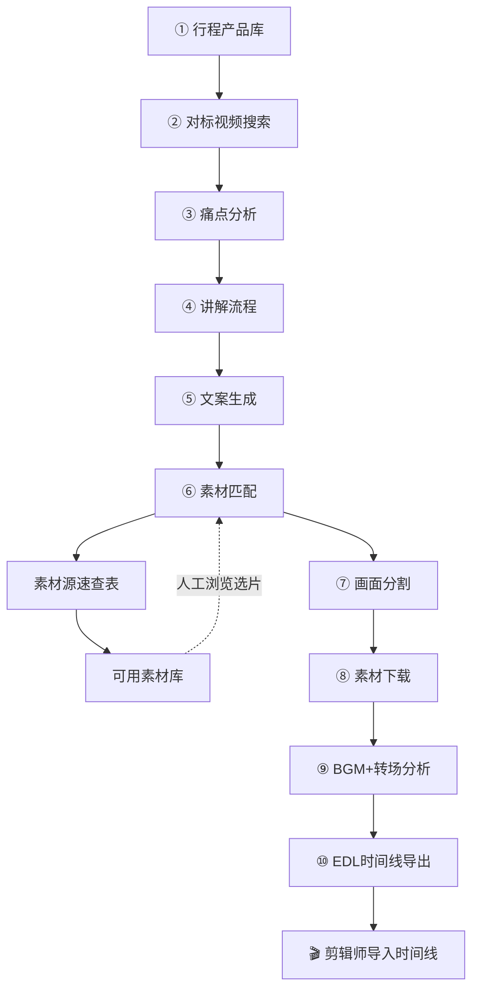
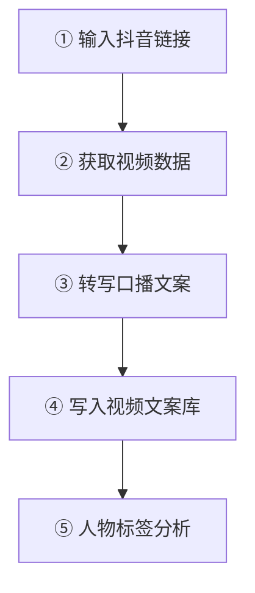

# 视频全链路工坊

> 三线流程：**旅行视频创作** + **抖音视频文案提取与分析** + **HeyGen AI数字人视频生成**
> v3.2 更新：全竖屏9:16标准化，多源搜索策略（TikTok英译/抖音直链/Ins/微博），文案增强匹配

---

## 📐 整体架构

```mermaid
flowchart LR
  subgraph A[创作线]
    A1[行程产品库] --> A2[对标搜索]
    A2 --> A3[痛点分析]
    A3 --> A4[文案生成]
    A4 --> A5[素材匹配]
    A5 ==> A6[素材清单]
    A6 -.->|人工选片替换| A5
    A6 -> A7[画面分割]
    A7 --> A8[素材下载]
  end
  
  subgraph B[分析线]
    B1[抖音链接] --> B2[视频下载]
    B2 --> B3[语音转写]
    B3 --> B4[文案入库]
    B4 --> B5[标签分析]
  end
  
  subgraph C[采集线：多平台竖屏搜索]
    C1[Mixkit] --- C2[TikTok]
    C2 --- C3[抖音/小红书]
    C3 --- C4[Instagram/微博]
  end
  
  C --> A6
```

---

# 🎬 创作线：旅行视频制作

> 输入目的地 → 自动出脚本 + 搜对标 + 下素材

## 核心流程（9步）



---

## 详细步骤

### Step 0: 前置准备

确保以下数据已就位：

1. **行程产品库**（Bitable）：产品名、天数、每日行程、住宿酒店等
2. **行程明细**（子表）：每天行程安排、活动亮点

### Step 1: 对标视频搜索

通过小红书搜索同类内容，获取脚本灵感和用户痛点。

```bash
# 小红书搜索
xhs search "<目的地> <关键词>" --json

# 读取笔记内容（含评论区）→ 分析用户真实痛点
xhs read <note-id> --json --xsec-token <token>
```

**输出** → `① 对标视频库`（Bitable子表）

字段：视频标题、来源平台、作者、点赞数、关联痛点、视频链接、关联产品

### Step 2: 痛点分析

从对标视频的正文 + 高赞评论中提炼用户核心痛点。

**输出** → `② 痛点分析`（Bitable子表）

字段：痛点描述、来源视频、目标人群、解决方案、关联产品、优先级

### Step 3: 讲解流程

将痛点 × 行程安排重组为脚本大纲（7步结构）。

标准结构：
| 步骤 | 环节 | 时长占比 |
|:----:|:-----|:--------:|
| 1 | 钩子开场 | 5s |
| 2 | 时间/季节选择 | 8s |
| 3 | 行程拆解 | 15s |
| 4 | 住宿推荐 | 8s |
| 5 | 行前准备 | 8s |
| 6 | 避坑指南 | 8s |
| 7 | 情感结尾 | 8s |

**输出** → `③ 讲解流程`（Bitable子表）

### Step 4: 文案生成

基于讲解流程，AI 自动生成完整口播文案（60-90秒）。

要求：
- 口语化、有网感
- 开头3行抓眼球
- 结尾引导互动（评论区扣1、收藏等）
- ❌ 正文不写具体金额（只说「打折优惠」「有活动」）
- ✅ 自动合规校验（替换违禁词）

**输出** → `④ 文案产出`（Bitable子表）

### Step 5: 素材匹配

将文案分段映射到对应镜头，标注每个镜头需要的素材类型。

**输出** → `⑤ 素材匹配`（Bitable子表）

**字段结构（v2 升级版）：**

| 字段 | 类型 | 说明 |
|:----|:----|:-----|
| 镜头编号 | Number | 顺序号 |
| 画面描述 | Text | 画面内容描述 |
| 对应文案 | Text | 对应口播文案片段 |
| 素材来源 | Text | YouTube/素材库/自拍 |
| 素材链接/路径 | Text | 下载链接或本地路径 |
| 是否已下载 | Select | 是/否 |
| 关联产品 | Text | 关联的旅游产品 |
| 画面分割 | Text | YouTube章节时间轴 |
| 素材类型 | Select | 酒店/动物/风景/转场/人物 |
| 主色调 | Select | 暖/冷/黑白/莫兰迪/复古 |
| 光线 | Select | 自然光/暖黄灯/金色时刻/夜景/蓝色时刻 |
| 镜头类型 | Select | 远景/中景/特写/航拍/延时/第一人称 |
| 分辨率 | Select | 4K/2K/1080p |
| 画面比例 | Select | 16:9横屏/9:16竖屏 |
| 帧率 | Number | 25/30/60 |
| 需要数量 | Number | 该类型镜头需几条素材 |

> 📎 素材需求完整标准见 `data/material_requirements_template.md`
> 📎 素材质量验收标准见 `data/material_quality_standards.md`

### Step 6: 画面分割（新增）

> 为剪辑师提供精准的时间轴索引，知道每个素材视频的哪些时段对应什么画面

对 `⑤ 素材匹配` 表中每条有 YouTube 链接的记录，自动执行：

1. **提取视频基础链接**（去掉 `&t=` 时间戳参数）
2. **使用 yt-dlp 获取视频章节信息**（`--dump-json` 中的 `chapters` 字段）
3. **章节标题翻译为中文**（保留英文原文作为对照）
4. **写入同一条记录的「画面分割」字段**

**画面分割格式示例：**
```
📺 Tanzania & Serengeti 4K - Scenic Wildlife Film
─── 共 11 段 ───
 1. [00:00-05:59] (359秒) 狂野坦桑尼亚
 2. [05:59-09:44] (225秒) 塞伦盖蒂动物群
 3. [09:44-12:50] (186秒) 桑给巴尔岛
...
```

**关键逻辑：**
- 同一条视频链接只分析一次（缓存），避免重复请求
- 所有引用同一视频的记录共用同一条章节信息
- 时间戳链接不变，剪辑师可直接点击跳转到对应时间点

**API 调用：**
- 字段类型：Text（纯文本，每行一个章节）
- 使用 PUT `records/{record_id}` 更新单条记录

### Step 7: 素材搜索与下载（素材下载）

从 YouTube 搜索高清无水印素材，默认 1080p。

```bash
# 搜索 YouTube
yt-dlp --no-check-certificate "ytsearch5:<关键词>" --dump-json

# 下载 1080p（默认画质）
yt-dlp --no-check-certificate -f "137+140" --merge-output-format mp4 \
  --ffmpeg-location "<ffmpeg路径>" \
  -o "<文件名>.mp4" "<YouTube链接>"
```

**ffmpeg 路径**（通过 imageio_ffmpeg 安装）：
```
/Library/Frameworks/Python.framework/Versions/3.12/lib/python3.12/site-packages/imageio_ffmpeg/binaries/ffmpeg-macos-x86_64-v7.1
```

**画质对照表：**

| 格式ID | 分辨率 | 编码 | 说明 |
|:------:|:------:|:----:|:----:|
| 137 | 1080p | H.264 | **默认**（视频only）|
| 136 | 720p | H.264 | 备选（视频only）|
| 140 | 128k | AAC | 配套音频流 |
| 18 | 360p | H.264+AAC | 一体包（降级） |

> ⚠️ 1080p/720p 为视频only流，需用 `+140` 合并音频，依赖 ffmpeg

---

## 📋 素材质量标准（运营剪辑验收标准）

> 以下标准来自运营剪辑实际需求，所有输出的素材必须符合以下要求。
> 详细文档见 `data/material_requirements_template.md` 和 `data/material_quality_standards.md`

### 分类需求配额

| 素材类型 | 数量 | 用途 |
|:--------|:---:|:-----|
| 🏨 酒店素材 | 30条 | 外观/客房/餐厅/泳池/特色细节/周边 |
| 🦁 动物素材 | 50条 | 动物特写/迁徙/捕猎/母子互动 |
| 🏔️ 风景素材 | 30条 | 草原/湖泊/火山/日出/星空/延时 |
| 🔄 转场素材 | 10条 | 机票/护照/登机牌/遮挡转场 |
| 👤 人物素材 | 10条 | 背影/侧脸/跑步/跳跃/旅行氛围 |

### 视觉质量要求

| 维度 | 标准 |
|:----|:-----|
| 画面比例 | **9:16 竖屏**，宽 < 高。禁止横屏素材 |
| 清晰度 | 不低于1080p，尽量4K。避免模糊、压缩过度 |
| 分辨率检测 | `ffprobe -v error -select_streams v:0 -show_entries stream=width,height -of csv=p=0 video.mp4` → 宽 < 高 = 竖屏通过 |
| 曝光 | 不过曝、不欠曝，人脸和细节可辨认 |
| 色彩 | 相对中性，不能偏色严重（如全屏偏绿/偏蓝） |
| 水印 | 无平台水印（抖音/快手/小红书Logo需去掉） |
| 文字/Logo | 无频道LOGO、字幕、台标 |
| 稳定性 | 手持尽量稳（有OIS），禁止剧烈抖动 |

### 时长与节奏

- 每个素材片段一般 **2-5秒**，口播穿插素材不超过 **4秒**
- 素材有**入点和出点**，开头结尾无黑帧、静止或无用内容
- 有动作的素材，从动作**开始前一秒**切到动作**结束前一秒**
- 氛围素材（水流/光影/街景）需能**无缝循环**或自然淡入淡出

### 风格一致性

- 同一视频内**色调统一**，不混搭「高饱和日系」和「暗调胶片」两种完全不同风格
- 实拍 vs 动画 vs 素材片的衔接自然，用转场或叠化过渡

### 分类拍摄细则

#### 🏨 酒店素材

**房间内景**——必须有的元素：床（铺好但微微掀开一角）、窗（透光）、床头细节（书、水杯、台灯）。禁止：空荡荡样板间感、刺眼直射光、凌乱电线。拍摄运动：缓慢推轨或固定机位带呼吸感。

**酒店景观**——时间选日出/日落/夜景，避免正午硬光。必须显示「从房间望出去」的边界（阳台栏杆、窗框）。

**公共区域**——避免客人正脸；池水干净反光。加分项：水波纹特写、躺椅上的椰子/书。

#### ✈️ 转场素材（机票/机场）

**值机**——登机牌与护照/行李牌同框；文字不可识别（保护隐私）。禁止出现条形码或二维码清晰可扫。

**机场氛围**——不拍到工作人员正脸。可选元素：航班信息屏（内容模糊）、行李箱排列。

**飞机窗景色**——避免玻璃反光拍到机舱内。最佳时间：起飞/降落时段、日落云层。

#### 🏛️ 景点素材

**地标**——无路人正脸；地标可识别但不喧宾夺主。禁止：过度饱和、现代广告牌入镜。

**美食**——食物完整、热气可见；避免手部全貌（只拍指尖和筷子）。建议同步生成音效。

### Step 8: BGM风格建议 & 卡点转场分析

> 🆕 v3.0 新增  |  不依赖视频下载，基于画面描述 + 素材类型 + 文案内容推理

#### 8.1 BGM风格建议

基于每个镜头的**素材类型** + **画面描述**匹配 BGM 风格，自动写入素材匹配表

**BGM 类型映射表：**

| 素材类型 | 基础BGM | 场景细化 |
|:--------|:--------|:--------|
| 🏔️ 风景 | 🌍 自然音效+轻柔管弦乐底垫 | 航拍→大气交响乐 / 日落→温暖吉他 |
| 🦁 动物 | 🥁 非洲鼓+紧张弦乐渐强 | 大迁徙→定音鼓重音 / 狮子→低频留白 |
| 🏨 酒店 | 🎵 Lounge/Bossa Nova度假风 | 客房→慢节奏 / 泳池→清凉电子 |
| 🔄 转场 | 🔊 whoosh音效+画面匹配音效 | 机票→快门声/翻页声 / 航拍→速度感 |
| 👤 人物 | 🎵 温暖钢琴/吉他中速 | 看日落→情感氛围乐 / 车内→轻快行进取 |

**写入字段：** `BGM风格建议`（Text）

#### 8.2 卡点转场建议

基于镜头编号顺序 + 画面内容，推荐转场方式和节奏处理

**转场类型映射：**

| 场景 | 推荐转场 |
|:-----|:---------|
| 开头第一镜 | 黑场淡入→2秒叠化进正片 |
| 场景切换（草原→海岛） | 硬切+自然音效（海浪声）衔接 |
| 高光瞬间（角马过河/跳跃） | 快切0.3秒+慢动作回放70% |
| 情感氛围（日落/星空） | 慢叠化2秒+颜色渐变 |
| 转场素材（航拍/机票） | 硬切+速度120%增加动感 |
| 常规素材衔接 | 叠化过渡（0.5-1秒） |

**写入字段：** `卡点转场建议`（Text）

#### 8.3 技术实现

```python
# 读取素材匹配表 → AI推理逐条写入
bgm = analyze_bgm(material_type, scene_description)
transition = analyze_transition(shot_number, scene_description)
update_bitable(record_id, {
    "BGM风格建议": bgm,
    "卡点转场建议": transition
})
```

> 无需下载视频，仅基于已有字段内容即可推理

---

### Step 9: EDL / FCPXML 时间线自动导出

> 🆕 v3.0 新增  |  一键生成剪辑软件可导入的时间线文件

#### 9.1 原理

从素材匹配表中读取每个镜头的：开始时间、结束时间、画面描述，生成标准时间线格式文件。

**支持的格式：**

| 格式 | 适用软件 | 说明 |
|:----|:---------|:-----|
| **EDL (CMX3600)** | Premiere Pro / DaVinci Resolve / Avid | 通用标准，入点出点自动设好 |
| **FCPXML** | Final Cut Pro | 素材按编号顺序排列 |
| **CSV 批导入表** | 通用 | 含镜头编号/文件名/时长/类型 |

#### 9.2 脚本

```bash
python3 projects/tanzania_materials/scripts/auto_cut_and_edl.py
# 输出:
#   timeline/*.edl     → Premiere/DaVinci
#   timeline/*.fcpxml  → Final Cut Pro
#   timeline/*.csv     → 通用批导入
```

#### 9.3 剪辑师操作流程

1. 运行脚本，生成时间线文件
2. 打开剪辑软件 → 文件 → 导入 → EDL / XML
3. 素材按镜头编号自动排列在时间线上
4. 拖入口播录音 → 按文案微调节奏 → 精剪交付

> 完整 SOP 见 `projects/tanzania_materials/剪辑师操作指南_SOP.md`

---

### 通用负面提示词

> 可用于 AI 生图的 negative prompt，也可作为素材筛选排除条件

```
禁止出现：模糊、抖动、过曝、死黑、噪点、颗粒感、卡通风格、
水印、文字、Logo、商标、人脸正面、裸露、武器、烟酒（除非必要）、
当代广告牌、手机界面、杂乱背景
```

---

# 📱 分析线：抖音视频文案提取

> 输入抖音链接 → 提取完整口播文案 + 分析人物标签

## 核心流程（5步）



---

## 详细步骤

### Step 1: 打开视频页面

使用 opencli browser 打开抖音视频，获取页面渲染状态。

```bash
opencli browser <session> open "https://www.douyin.com/video/<aweme_id>"
sleep 5  # 等待页面加载
```

### Step 2: 获取视频数据

通过抖音内部 API 获取视频元数据（标题、时长、作者、下载地址）。

```javascript
// 同步 XHR 获取视频详情
var xhr = new XMLHttpRequest();
xhr.open('GET', 'https://www.douyin.com/aweme/v1/web/aweme/detail/?aweme_id=<aweme_id>', false);
xhr.withCredentials = true;
xhr.send(null);
var ad = JSON.parse(xhr.responseText).aweme_detail;
```

**关键字段：**
- `desc` — 视频标题（含话题标签）
- `duration` — 时长（毫秒）
- `author.nickname` — 作者昵称
- `video.play_addr.url_list[0]` — 播放地址
- `video.download_addr.url_list[0]` — 下载地址
- `is_subtitled` — 是否有内置字幕（0=无）
- `video_text` — 内置字幕文本（可能为空）

### Step 3: 下载视频与语音转写

从获取到的播放/下载地址下载视频，提取音频后使用 faster-whisper 转写。

```bash
# 下载视频
curl -sL -o /tmp/dy_video.mp4 \
  -H "Referer: https://www.douyin.com/" \
  -H "User-Agent: Mozilla/5.0 ..." \
  "$PLAY_URL"

# 提取音频（16kHz, mono, PCM）
ffmpeg -i /tmp/dy_video.mp4 -vn -acodec pcm_s16le -ar 16000 -ac 1 /tmp/dy_audio.wav -y
```

**转写（默认 medium 模型）：**

```python
from faster_whisper import WhisperModel

# 默认使用 medium 模型
model = WhisperModel("medium", device="cpu", compute_type="int8")
segs, info = model.transcribe("/tmp/dy_audio.wav", language="zh", beam_size=5)
text = "\n".join([s.text.strip() for s in segs])
```

**模型选择对照表：**

| 模型 | 准确度 | 速度 | 内存 | 适用场景 |
|:----|:------|:----|:----|:--------|
| tiny | 低 | 极快 | ~1GB | 快速预览 |
| small | 中 | 快 | ~2GB | 一般视频 |
| **medium** | **高** | **中等** | **~3GB** | **⭐ 默认推荐** |
| large-v3 | 最高 | 慢 | ~6GB | 高精度需求 |

> 视频较长时间 medium 会较慢（2分钟视频约需几分钟CPU处理），特殊需求可升级为 large-v3

### Step 4: 写入视频文案库

将转写结果写入 Bitable「视频文案库」表格。

**表结构（主表 — `⑥ 视频文案库`）：**

| 字段 | 类型 | 说明 |
|:----|:----|:-----|
| 视频标题 | Text（主字段） | 含标注所用模型（如 `(medium模型)`） |
| 视频链接 | Text | 抖音原始链接 |
| 来源平台 | Text | 抖音/YouTube/小红书 |
| 作者 | Text | 视频发布者 |
| 时长(秒) | Number | 视频长度 |
| 口播文案 | Text（长） | 完整语音转写文本 |
| 文案摘要 | Text | 前几句摘要 |
| 备注 | Text | 注明所用模型等信息 |

**API 调用：**
```python
api_call("POST", f"https://open.feishu.cn/open-apis/bitable/v1/apps/{APP}/tables/{TID}/records",
        {"fields": fields})
```

**不同模型版本管理：**
- 同一个视频可以用不同模型多次转写
- 每条记录单独一条，标题标注模型名（如 `xxx (medium模型)`）
- 方便对比不同模型的效果差异

### Step 5: 人物标签分析

从口播文案中提取人物相关标签，写入「人物标签分析」子表。

**表结构（子表 — `人物标签分析`）：**

| 字段 | 类型 | 说明 |
|:----|:----|:-----|
| 标签名称 | Text（主字段） | 如 `NPD/自恋人格`、`背靠车澈` |
| 标签类别 | Text | 人物身份/性格标签/情感标签/文化梗/... |
| 关联视频 | Text | 来源视频标题 |
| 关联来源 | Text（长） | **完整上下文**——文案中与标签相关的段落 |
| 标签描述 | Text | 简短说明 |

**标签分类体系：**

| 类别 | 示例 |
|:----|:-----|
| 人物身份 | Rapper/说唱歌手、留学生、独立音乐人、一名爸爸 |
| 性格标签 | 有态度、情绪稳定、缺乏同理心、NPD倾向 |
| 背景标签 | 背靠车澈、数字游民 |
| 情感标签 | 离异带娃、怀念前任、只接受CH relationship |
| 文化梗 | A3 = honest、AA制 |
| 风格标签 | 霸道总裁风 |
| 话题标签 | 20岁 vs 40岁、对钱没概念 |
| 受众标签 | 姐妹团鉴定 |
| 评价标签 | 第三性感的男人 |

**标签分析原则：**
- 每个标签必须附带**上下文原文**（关联来源字段），让剪辑师一眼看懂来源
- 上下文是完整段落而非单个句子
- 同类型的标签归入统一类别

---

> 📎 素材需求完整标准见 `data/material_requirements_template.md`
> 📎 素材质量验收标准见 `data/material_quality_standards.md`

---

### 5.1 素材源速查表（多平台竖屏采集）

> **核心原则：所有素材必须为 9:16 竖屏视频**，通过分辨率/画面比例字段筛选验收

**多平台搜索策略：**

| 平台 | 搜索方式 | 链接格式 | 竖屏支持 |
|:----|:---------|:---------|:--------|
| **Mixkit** | 加 `?orientation=vertical` 参数 | https://mixkit.co/free-stock-video/discover/{category}/?orientation=vertical | ✅ 竖屏分类页 |
| **TikTok** | 关键词**先翻译成英文**（及其他语言），再用 `search/video/` | `https://www.tiktok.com/search/video/{英文关键词}` | ✅ 全部竖屏 |
| **抖音** | 获取**具体视频 aweme_id**，构造播放页链接 | `https://www.douyin.com/video/{aweme_id}` | ✅ 全部竖屏 |
| **小红书** | xhs CLI 指定 `--type video` | `https://www.xiaohongshu.com/explore/{id}` | ✅ 全部竖屏 |
| **Instagram** | 搜 Reels 短视频 | `https://www.instagram.com/reels/search/?q={英文关键词}` | ✅ 全部竖屏 |
| **微博** | 搜视频 + 筛选 | `https://s.weibo.com/weibo?q={URL编码关键词}&typeall=1&subtype=video` | ✅ 部分竖屏 |

---

#### TikTok 搜索规则（关键词翻译）

中文关键词 → 必须先翻译为英文及其他语言，再拼接搜索链接：

```
# ❌ 错误
琅勃拉邦布施 → https://www.tiktok.com/search/video/琅勃拉邦布施

# ✅ 正确
琅勃拉邦布施 → 英文: "Luang Prabang alms giving"
  → https://www.tiktok.com/search/video/Luang%20Prabang%20alms%20giving

曼谷大皇宫 → 英文: "Bangkok Grand Palace"
  → https://www.tiktok.com/search/video/Bangkok%20Grand%20Palace

# 多语言优先顺序：英文 > 目标国家语言 > 中文
巴厘岛精灵沙滩 → 英文: "Bali Kelingking Beach"
  → https://www.tiktok.com/search/video/Bali%20Kelingking%20Beach
```

**翻译对照表（常见东南亚关键词）：**

| 中文 | 英文 | 印尼语/泰语/老挝语 |
|:----|:----|:------------------|
| 琅勃拉邦布施 | Luang Prabang alms giving | — |
| 万荣独木舟 | Vang Vieng kayaking | — |
| 曼谷大皇宫 | Bangkok Grand Palace | พระบรมมหาราชวัง |
| 槟城乔治市壁画 | Penang George Town street art | — |
| 吉隆坡双子塔 | KLCC Petronas Towers | — |
| 巴厘岛精灵沙滩 | Bali Kelingking Beach | Pantai Kelingking |
| 伊真火山蓝火 | Ijen volcano blue fire | Api biru Kawah Ijen |
| 布罗莫火山日出 | Mount Bromo sunrise | Gunung Bromo |

---

#### 抖音搜索规则（具体视频链接）

❌ 不要用抖音搜索链接：`https://www.douyin.com/search/{关键词}?type=video`
✅ 必须用**具体视频播放页链接**：`https://www.douyin.com/video/{19位aweme_id}`

获取方式：
1. 用 opencli browser 打开抖音搜索页 → 获取视频列表
2. 从页面中提取每个视频的 aweme_id（19位数字）
3. 拼接为 `https://www.douyin.com/video/{aweme_id}`
4. 或通过 xhs CLI 搜抖音内容获取直链

```javascript
// opencli browser 获取抖音视频ID
var xhr = new XMLHttpRequest();
xhr.open('GET', 'https://www.douyin.com/aweme/v1/web/search/item/?keyword=...&type=1', false);
xhr.withCredentials = true;
xhr.send(null);
var data = JSON.parse(xhr.responseText);
data.data.forEach(function(item) {
  var aweme_id = item.aweme_info.aweme_id;
  console.log('https://www.douyin.com/video/' + aweme_id);
});
```

---

#### Instagram 搜索规则

```
# 在 Instagram 搜 Reels
https://www.instagram.com/reels/search/?q={英文关键词}

# 或在站内 search 后选 Reels 标签
```

---

#### 微博搜索规则

```
# 微博视频搜索
https://s.weibo.com/weibo?q={URL编码关键词}&typeall=1&subtype=video

# 示例（琅勃拉邦布施）
https://s.weibo.com/weibo?q=%E7%90%85%E5%8B%83%E6%8B%89%E9%82%A6%E5%B8%83%E6%96%BD&typeall=1&subtype=video
# 需要用 urllib.parse.quote() 编码关键词
```

---

**素材验收标准（新增竖屏分辨率检测）：**

| 验收项 | 标准 | 方法 |
|:------|:-----|:-----|
| 画面比例 | **9:16 竖屏** | ffprobe 检测分辨率，宽 < 高即为竖屏 |
| 分辨率 | ≥1080×1920 | `ffprobe -v error -select_streams v:0 -show_entries stream=width,height -of csv=p=0 video.mp4` |
| 帧率 | ≥30fps | `ffprobe -v error -select_streams v:0 -show_entries stream=r_frame_rate -of default=noprint_wrappers=1 video.mp4` |

```bash
# 竖屏检测命令
ffprobe -v error -select_streams v:0 -show_entries stream=width,height -of csv=p=0 video.mp4
# 输出示例: 1080,1920 → 竖屏(9:16)  ✓
# 输出示例: 1920,1080 → 横屏(16:9)  ✗
```

---

### 5.2 ⑥ 素材清单（多平台统一表结构）

**表字段（v2）：**

| 字段 | 类型 | 说明 |
|:----|:----|:-----|
| 镜头编号 | Number | 关联⑤素材匹配表 |
| 画面描述 | Text | 精确的画面内容描述 |
| 对应文案 | Text（长） | **完整对应文案段落**，不止片段，提升搜索匹配度 |
| 素材链接 | Text(URL) | 具体视频直链 |
| 来源平台 | Select | TikTok / 抖音 / 小红书 / Instagram / 微博 / Mixkit |
| 画面比例 | Select | 9:16竖屏 ✅ |
| 关键词(英) | Text | 搜索时使用的英文关键词，便于溯源和复用 |
| 关键词(本地) | Text | 搜索时使用的本地语言关键词 |
| 分辨率检测 | Text | 已检测/待检测 |

**对应文案字段（关键改进）：**

```
# ❌ 之前：只有片段
"下午去万荣划独木舟"

# ✅ 现在：完整文案段落
"第一站琅勃拉邦，4天慢节奏，清晨看布施，下午去万荣划独木舟。然后飞曼谷，虽然只待1天，但大皇宫+湄南河夜游一个不少。"
```

完整文案段落 → 搜索时作为上下文 → 提高AI匹配准确度

**每个镜头至少3条链接且来源不重复：**

```
镜头1（地图/航线）
  ├─ TikTok: https://www.tiktok.com/search/video/Southeast%20Asia%20travel%20route
  ├─ 抖音: https://www.douyin.com/video/{aweme_id}
  └─ 小红书: https://www.xiaohongshu.com/explore/{id}
```

---

# 🗄️ Bitable 表结构

## 创作线

基础表：**行程产品库**（产品信息 + 行程明细）

| 子表 | 用途 | 数据来源 |
|:----|:-----|:--------:|
| ① 对标视频库 | 储存搜索到的对标视频 | xhs search |
| ② 痛点分析 | 提炼的用户痛点 | AI 分析 |
| ③ 讲解流程 | 脚本大纲 | AI 生成 |
| ④ 文案产出 | 完整口播文案 | AI 生成 |
| ⑤ 素材匹配 | 镜头→素材映射 + 画面分割 + BGM风格 + 卡点转场 | AI 匹配 + yt-dlp 章节分析 |
| ⑥ 可用素材库 | 已采集的素材索引，供人工浏览选片 → 反馈回⑤ | Mixkit/Pexels 采集 + 人工录入 |

## 分析线

**独立多维表格：视频文案库**

| 表名 | 用途 | 数据来源 |
|:----|:-----|:--------:|
| ⑥ 视频文案库 | 主表：每条视频一条记录，含口播文案 | faster-whisper 转写 |
| 人物标签分析 | 子表：从文案提取的人物标签及上下文 | AI 分析 |

## 采集线

**独立多维表格：{产品名} - 全流程**

| 编号 | 表名 | 用途 |
|:---:|:----|:-----|
| ①～⑤ | 创作线标准7张子表 | 同上 |
| ⑥ | **素材清单** | 多平台竖屏视频链接索引，每个镜头3+条，含来源/关键词/文案段落 |

---

## ⚠️ 已知踩坑

### 2026-06-01 首次跑通

1. **xhs CLI 安装**：`xiaohongshu-cli` 需要 Python 3.10+，通过 `uv run` 绕开
   - 命令：`xhs`（cd 项目目录后 `uv run xhs`）
2. **小红书视频带水印**：源文件服务器端嵌入水印，CDN 直链也有 ❌
   - ✅ 改用 YouTube 作为素材源
3. **yt-dlp + ffmpeg**：高画质视频only流需要 ffmpeg 合并音视频
   - 通过 `pip3 install imageio-ffmpeg` 安装 ffmpeg 二进制
4. **小红书链接格式**：`search_result` 格式需转 `explore` 格式才能直接打开
   - `search_result/{id}` → `explore/{id}`
5. **行程表结构**：按 docx 文档模板抽取字段（产品名称/天数/每日行程/酒店等）

### 2026-06-02 画面分割字段

1. **「画面分割」字段用于记录视频章节索引**：每条素材记录对应一个 YouTube 视频链接，通过 yt-dlp 的 `--dump-json` 获取 `chapters` 字段
2. **中文翻译**：自动将章节标题从英文映射为中文（如 `Great Migration of the Serengeti` → `角马大迁徙/天河之渡`），方便剪辑师直接使用
3. **去重缓存**：多条记录引用同一视频时，只请求一次 yt-dlp，章节信息复用
4. **不是拆成多条记录，而是写入同一条的字段**：这一点容易理解错——画面分割是单条记录的一个字段，包含该视频的完整时间轴

#### 素材匹配表 v3.0 新增字段

| 字段 | 类型 | 说明 |
|:----|:----|:-----|
| BGM风格建议 | Text | 基于画面内容的背景音乐推荐 |
| 卡点转场建议 | Text | 逐镜头的转场方式和节奏建议 |

---

## 剪辑师 SOP 文档

每次全链路跑通后，自动生成剪辑师操作指南：

```
projects/{product_name}/剪辑师操作指南_SOP.md
```

包含：
- 素材目录结构说明
- 时间线导入步骤（EDL / FCPXML / CSV）
- 代理文件（720p）挂载说明
- 素材类型 & 建议时长速查表
- 调色规范 & 交付标准

---

### 2026-06-02 抖音文案提取

1. **不能用 yt-dlp 直接下载抖音**：抖音需要 `cookie` 策略，但 yt-dlp 的 douyin extractor 会报 `Fresh cookies needed`。需通过 opencli browser 的 XHR 获取直链下载
2. **`opencli browser eval` 的 `let` 作用域**：跨 eval 调用时 `let` 变量名会冲突，使用 `var` 代替
3. **抖音 API 直链有时效性**：获取播放地址后需立即下载，过期后 token 验证会失败
4. **视频内置字幕（`is_subtitled`）**：大部分抖音口播视频 `is_subtitled=0`（无内置字幕），必须走语音转写。如有内置字幕可通过 `video_text` 字段直接获取
5. **faster-whisper medium 模型下载慢**：1.4GB 模型文件，从 HuggingFace 下载需使用代理（`http://127.0.0.1:7897`），建议提前下载好
6. **faster-whisper 懒迭代**：`model.transcribe()` 返回的 segments 是惰性生成器，实际计算在 `for seg in segments:` 迭代时发生。如果用 `list(segments)` 会阻塞 UI，建议直接迭代
7. **medium 模型资源消耗**：2分钟视频需 ~3GB 内存 + 数分钟 CPU 处理。CPU 场景下 `large-v3` 可用但更慢
8. **`json.l…()` 转义问题**：写 Python 脚本时注意 `json.loads(f.read().decode())` 不要被 Unicode `…` 字符污染——建议使用 `sed` 或 `python3 -c` 辅助修复
9. **Bitable 字段名匹配**：`PATCH /permissions` 设置公开访问时，`link_share_entity` 和 `external_access_entity` 需要单独 PATCH，批量会报 `field validation failed`
10. **`ctx` SSL 上下文冲突**：在 `api()` 函数中不要用 `ctx` 作为 with-statement 的变量名，会和外层 SSL context 冲突导致 `'str' object has no attribute 'wrap_socket'`

---

# 🤖 AI数字人视频生成（HeyGen）

> 将文案通过 HeyGen API 生成数字人口播视频
> 一句话：**文案 → 数字人形象 + 语音 → 口播视频**

## 前置准备

```bash
export HEYGEN_API_KEY="your-api-key-here"
```

## 使用方式

```bash
# 查看可用的数字人形象
python3 skills/video-generation/scripts/heygen_api.py list-avatars

# 从文案生成数字人视频
python3 skills/video-generation/scripts/heygen_api.py generate \
  --text "口播文案内容" \
  --title "视频标题" \
  --wait

# 从文案文件生成
python3 skills/video-generation/scripts/heygen_api.py script \
  --script /tmp/transcript.txt \
  --wait
```

## 与工坊的整合

```
文案产出 → ① HeyGen数字人（AI口播路线）
         → ② 素材匹配（传统剪辑路线）
```

---

## 工具依赖

| 工具 | 安装方式 | 用途 |
|:----|:---------|:-----|
| xhs（xiaohongshu-cli） | `git clone + uv run` | 小红书搜索/读取CDN链接 |
| yt-dlp | `pip3 install yt-dlp` | YouTube 视频搜索+下载 |
| ffmpeg（imageio-ffmpeg） | `pip3 install imageio-ffmpeg` | 视频提音频，合并音视频流 |
| opencli | `npm install -g @jackwener/opencli` | 小红书/抖音平台通用接口 + 浏览器桥接 |
| faster-whisper | `pip3 install faster-whisper` | **⭐ 语音转写（默认 medium 模型）** |
| HeyGen API | `export HEYGEN_API_KEY=xxx` | **🆕 AI数字人口播视频生成** |

### faster-whisper 模型缓存

模型文件默认缓存到 `~/.cache/huggingface/hub/`，下载后复用。

```bash
# 提前手动下载 medium 模型（推荐）
curl -L --proxy http://127.0.0.1:7897 \
  -o ~/.cache/huggingface/hub/models--Systran--faster-whisper-medium/blobs/model.bin \
  "https://huggingface.co/Systran/faster-whisper-medium/resolve/main/model.bin"
```

---

## 快速参考

### 从抖音链接到文案（一句话版）

```bash
# 1. opencli browser 打开视频
opencli browser dyvideo open "https://www.douyin.com/video/<aweme_id>"

# 2. 获取下载链接
PLAY_URL=$(opencli browser dyvideo eval '<xhr code>' 2>&1 | grep "^http")

# 3. 下载+提音频
curl -sL -o /tmp/dy.mp4 -H "Referer: https://www.douyin.com/" "$PLAY_URL"
ffmpeg -i /tmp/dy.mp4 -vn -ar 16000 -ac 1 /tmp/dy.wav -y

# 4. 转写（medium）
python3 -c "from faster_whisper import WhisperModel;\
model=WhisperModel('medium',device='cpu',compute_type='int8');\
text='\\n'.join(s.text.strip() for s in model.transcribe('/tmp/dy.wav',language='zh',beam_size=5)[0]);\
open('/tmp/transcript.txt','w').write(text)"

# 5. 写入 Bitable
# 见上方的 API 调用示例
```

---

## 完整工作流参考

详细的 Bitable 操作、opencli browser 使用、标签分析逻辑等，参考以下会话记录：
- 2026-06-02 抖音文案提取 + 标签分析完整流程
- 2026-06-01 首次跑通 + 画面分割功能
