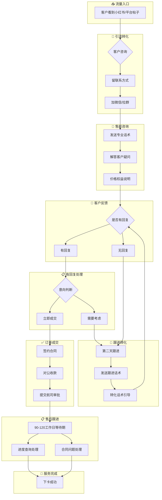
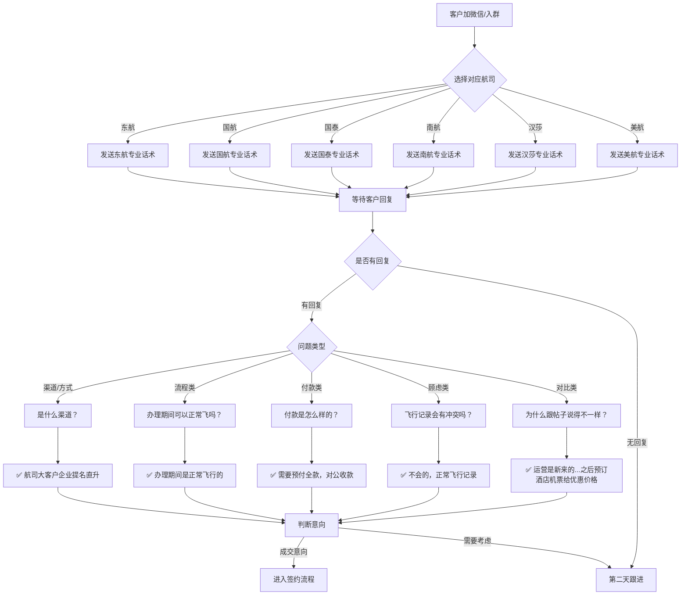
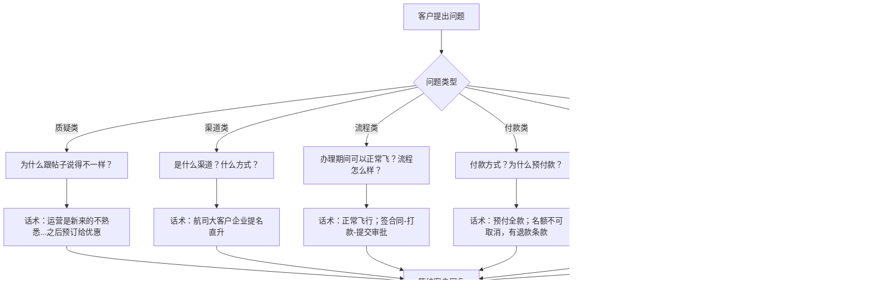
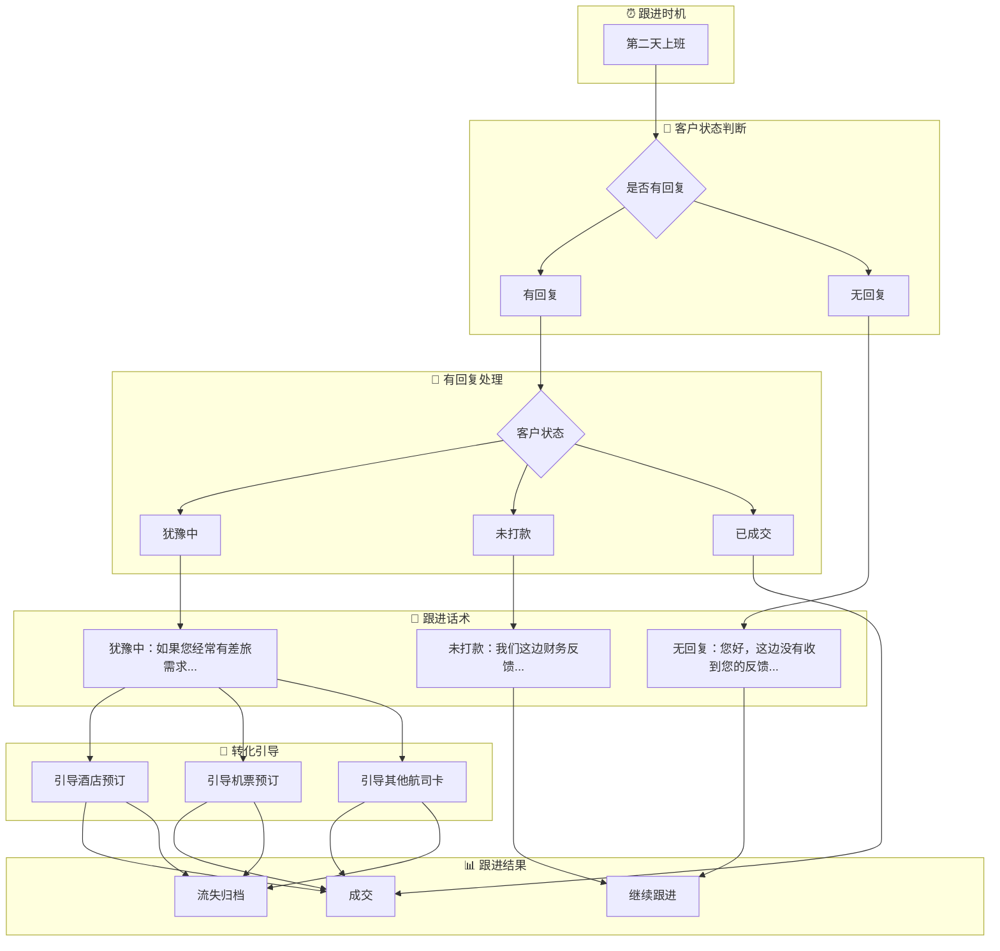
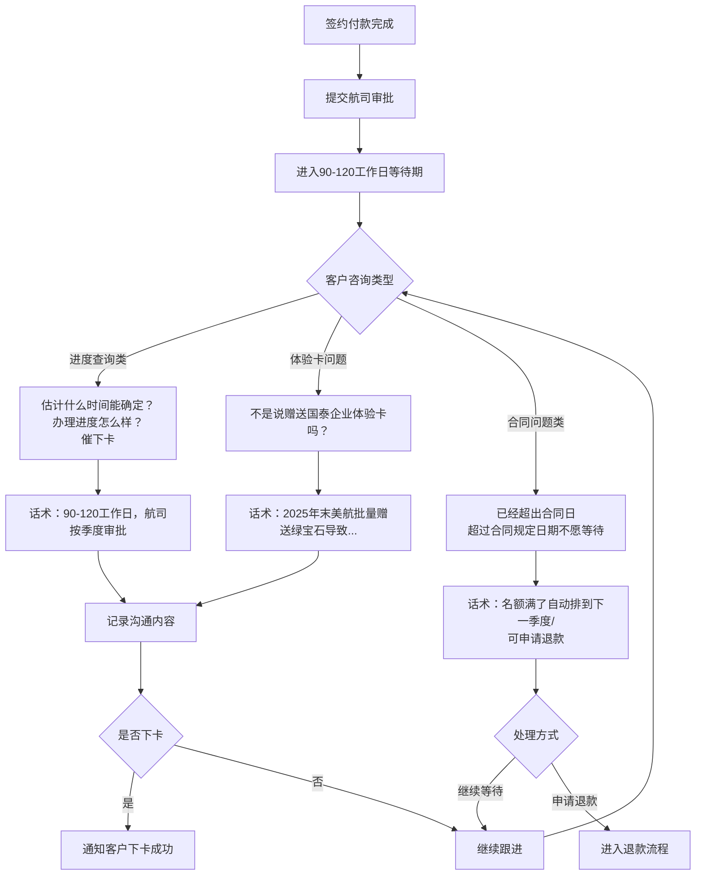
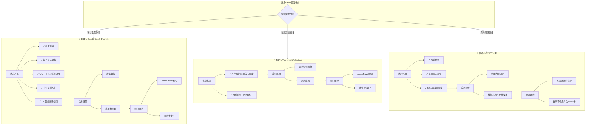
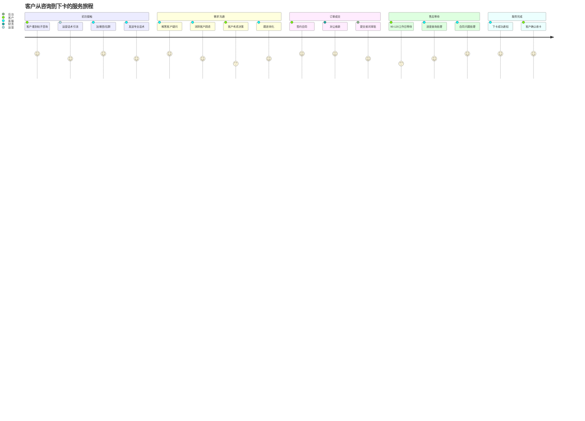

---

## 一、整体业务流程图

---

## 二、各航空公司产品话术对照表

### 2.1 运营端发布话术（引流用）

| 航空公司   | 运营话术                                                                  | 💡 技巧提示                     |
| ------ | --------------------------------------------------------------------- | --------------------------- |
| **国航** | 国航终身白金卡业务3W，航司会籍业务签协议交付，季度下卡。对公账户收款，会有专员详细介绍                          | 💡 强调"终身"价值 💡 突出对公收款安全  |
| **东航** | 中国东方航空白金卡三年3w业务办理，含72张升舱券。不含积分和升舱券的，只享受会员和休息室权益的小几千块一年。签约交付，对公支付，可开发票 | 💡 对比两种方案 💡 突出升舱券价值     |
| **国泰** | 国泰航空钻石卡业务办理，两年3w元，五年8w元，办理期间可以体验4个月绿宝石企业体验卡，90-120工作日下卡，签约交付，对公付款     | 💡 强调体验卡权益 💡 两种周期选择     |
| **南航** | 南方航空铂金卡业务办理，3年3w元。航司会籍业务签协议交付，季度下卡。对公账户收款，会有专员详细介绍                    | 💡 突出铂金等级 💡 强调季度下卡      |
| **汉莎** | 汉莎终身金卡业务办理，7.5w元90-120工作日下卡，赠送130w里程对公账户收款，签协议交付                      | 💡 强调130w里程价值 ⚠️ 价格较高需铺垫 |
| **美航** | 美航终身白金卡业务办理，3w元，90-120工作日下卡，办卡期间体验4个月绿宝石权益，对公账户收款，签协议交付               | 💡 终身+体验卡双重吸引               |

### 2.2 客服端专业话术（转化用）

| 航空公司 | 通用话术 | 专业话术 | ⚠️ 注意事项 |
|---------|---------|---------|------------|
| **东航白金卡** | 什么渠道直升或走什么渠道 | 东方航空白金卡业务办理，含积分和升舱券，3年3w元，办理期间正常飞行，90-120工作日下卡，签约交付，对公收款 | ✅ 回复：航司大客户企业提名直升 ❌ 不要说"买卡""代办"等敏感词 |
| **国航终身白金卡** | 如果不是办XX航的XX卡，只是匹配XX同等权益... | 中国国航航空终白业务办理，终身3w元，办理期间正常飞行，90-120工作日下卡，签约交付，对公收款 | ⚠️ 注意：国泰航空是属于寰宇一家会员，和国航星空联盟不是同一个联盟 ❌ 不要混淆联盟概念 |
| **国泰钻石卡** | 您好～您留个kfs～这边会有专员跟您对接～ | 国泰航空钻石卡业务办理，含升舱券，2年3w元，5年8w元，办理期间可以体验4个月绿宝石企业体验卡，90-120工作日下卡，签约交付，对公付款 | 💡 先留联系方式再发详细话术 ✅ 强调体验卡即时可用 |

---

## 三、售前咨询流程图

---

## 四、常见问题应对流程图

### 4.1 详细问答对照表（带标记版）

| 客户问题 | 回复话术 | 标记说明 |
|---------|---------|---------|
| **为什么跟帖子说得不一样？** | 不好意思，这边运营是新来的，对我们的业务还不太熟悉，对您造成不好的体验，我们深感抱歉。您看这样如何，之后您在我们这边预订酒店机票的话我们给您做更有优惠的价格～ | 💡 安抚+转化技巧 ✅ 主动提供补偿方案 |
| **是什么渠道？什么方式？怎么做到的？** | 航司大客户企业提名直升 | ✅ 标准回复 ❌ 不要说"买卡""代办""刷分"等敏感词 |
| **办理期间可以正常飞吗？** | 办理期间是正常飞行的 | ✅ 明确答复 ⚠️ 不要含糊其辞 |
| **流程是怎么样的？** | 签合同-打款-提交航司审批的 | ✅ 三步流程简洁明了 |
| **付款是怎么样的？** | 需要您预付全款的 | ✅ 明确付款要求 ⚠️ 不要承诺分期 |
| **为什么要预付款？不能分期？** | 因为名额提交上去不可取消，所以我们只能预付，如果未在规定时间内批复，我们的协议条款里面有退款期限和赔付条款 | 💡 解释原因+保障条款 ✅ 增强信任感 |
| **怎么收款？** | 对公收款，付款看您。我们也可以企业支付宝收款的 | ✅ 提供灵活选择 💡 对公优先，支付宝备选 |
| **这样飞行记录会有冲突吗？** | 不会的，正常飞行记录的还是 | ✅ 消除顾虑 ❌ 不要解释太多技术细节 |
| **考虑** | 您考虑研究看看 | ✅ 留有余地 ⚠️ 不要逼单太紧 |
| **卓白什么价格？能办理吗？** | 卓越目前没有名额了，只有终白 | 💡 引导到其他产品 ✅ 不要直接说"不做" |

---

## 五、跟进转化流程图

### 5.1 跟进话术详细对照表

| 跟进场景 | 话术内容 | 标记说明 |
|---------|---------|---------|
| **第二天跟进（无回复）** | 您好，这边没有收到您的反馈，您是还有什么疑虑和不明白的？ | ✅ 主动询问疑虑 💡 语气要柔和 |
| **客户犹豫转化** | 如果您经常有差旅需求，可以找我们优惠预订豪华连锁品牌酒店和国际商务舱机票，可以和平台对比下价格和待遇的 | 💡 转化到其他业务 ✅ 提供价值对比 |
| **未打款催单** | 对于还未打款的客户，我们这边财务反馈，请添加一下收款信息和业务的相关备注信息以及业务 | ⚠️ 用财务角度施压 ✅ 制造紧迫感 |

---

## 六、售后跟进流程图

### 6.1 售后话术详细对照表

| 客户问题 | 回复话术 | 标记说明 |
|---------|---------|---------|
| **进度查询类** | 一般都是90-120工作日，航司都是按季度审批的 | ✅ 明确时间预期 ⚠️ 不要承诺具体日期 |
| **办理进度查询（详细版）** | 如果未超过合同期限，还请您耐心等待；如果超过合同期限，您也可以向我们申请退费；办卡下来了就能直接看到等级变化，如未变动，则还未升级成功；办理成功您第一时间会收到（xx航司）发给您的短信的喔 | 💡 分情况处理 ✅ 提供退款保障 |
| **体验卡问题** | 因为2025年末期间美国航空批量赠送绿宝石，导致正常的绿宝石匹配机制受到了严重的冲击，咱们这边也在积极地申请呢 | ⚠️ 解释外部原因 💡 表达积极处理态度 |
| **合同问题-超期** | 已经超出合同日，审核没过呢～航司那边名额满了都是自动给您排到下一个季度去的～ | ⚠️ 解释自动排期机制 |
| **合同问题-退款** | 如果说确实已经超过了咱们合同规定日期的，且您也不愿意再等待的，您也是可以向我们提出退款申请的 | ✅ 提供退款选项 |

### 6.2 售后沟通原则

> ⚠️ **重要提示**：灵活运用，不要太死板，真人感强一点

> 💡 **主动沟通**：别偷懒，动脑子发，语气软一点，可以主动问问客户为什么等不住了？或者说近期是否有出行的这种需求？

---

## 七、酒店机票业务流程

### 7.1 Amex酒店计划对比流程图

### 7.2 Amex酒店计划对比表

| 对比维度 | FHR | THC | 礼遇小程序 |
|---------|-----|-----|-----------|
| **核心礼遇** | ✓ 房型升级 ✓ 每日双人早餐 ✓ 保证下午4点延迟退房 ✓ 100美元额度 | ✓ 连住2晚得100美元额度 ✓ 房型升级(视房态) | ✓ 房型升级 ✓ 每日双人早餐 ✓ 50-100美元额度 |
| **适用场景** | 奢华度假 重要纪念日 | 城市短途 周末度假 | 中国内地酒店 微信小程序便捷预订 |
| **预订要求** | AmexTravel预订 白金卡支付 | AmexTravel预订 连住2晚以上 | 美国运通小程序 出示符合条件的Amex卡 |
| **⚠️ 注意事项** | 升级视房态 部分房型不参与 | 必须连住2晚 | 礼遇不可叠加 通常需预付且不可取消 |

---

## 八、关键要点总结

### 8.1 沟通原则

| 原则 | 说明 | 标记 |
|------|------|------|
| **真人感** | 灵活运用话术，不要太死板 | 💡 |
| **主动性** | 别偷懒，动脑子发，语气软一点 | ✅ |
| **转化意识** | 主动询问客户需求，引导其他服务 | 💡 |
| **耐心跟进** | 第二天必须跟进未回复客户 | ⚠️ |
| **合规表达** | 避免敏感词汇，用"企业提名"代替"买卡" | ❌ |

### 8.2 时间节点

| 阶段 | 时间 | 动作 | 标记 |
|------|------|------|------|
| 首次跟进 | 第二天上班 | 查看群聊，无回复则发跟进话术 | ⚠️ 必须执行 |
| 审批周期 | 90-120工作日 | 告知客户耐心等待 | ✅ 明确预期 |
| 超期处理 | 超过合同日期 | 可申请退款或继续等待 | 💡 灵活处理 |

### 8.3 价格体系速查

| 产品 | 价格 | 周期 | 特色权益 |
|------|------|------|---------|
| 国航终白 | 3W | 终身 | 季度下卡 |
| 东航白金 | 3W/3年 | 3年 | 含72张升舱券 |
| 国泰钻石 | 3W/2年 或 8W/5年 | 2年/5年 | 4个月绿宝石体验 |
| 南航铂金 | 3W/3年 | 3年 | 季度下卡 |
| 汉莎金卡 | 7.5W | 终身 | 赠送130w里程 |
| 美航白金 | 3W | 终身 | 4个月绿宝石体验 |

### 8.4 标记符号说明

| 符号 | 含义 | 使用场景 |
|------|------|---------|
| ✅ | 正确操作 | 应该这样做 |
| ❌ | 错误操作 | 不应该这样做 |
| ⚠️ | 注意事项 | 需要特别注意 |
| 💡 | 技巧提示 | 更好的做法 |

---

## 九、完整服务旅程图

---

*文档生成时间：2026年5月16日*
*基于《客服话术老版本（与新话术对照，灵活运用）》整理*
*版本：可视化流程图版V2（优化判断分支）*
